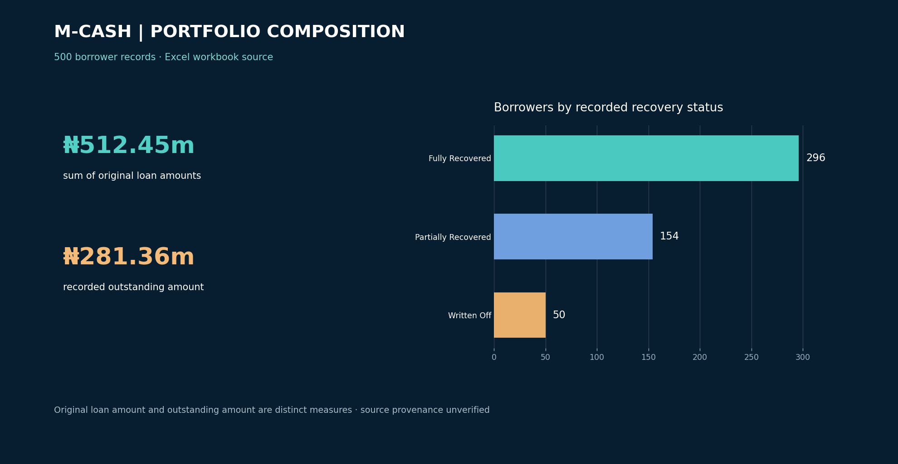

# M-CASH loan recovery analysis

**Question:** How can a loan portfolio be monitored by recovery status, loan type and outstanding exposure?

An Excel workbook presents borrower and recovery views for management review. Its pivot-based dashboard separates fully recovered, partially recovered and written-off accounts, with segments for loan type and borrower characteristics.

## Approach

Review recovery status and balances at borrower level, then use the workbook's pivot tables to compare status by loan type and identify large outstanding amounts. The workbook contains **500 distinct borrower IDs**, **₦512,453,516 in `Loan_Amount`** and **₦281,362,988.34 in `Outstanding_Loan_Amount`**. These are different measures: the first sums original loan amounts; the second sums recorded outstanding exposure.

The source table records **296 fully recovered**, **154 partially recovered** and **50 written-off** loans. There is no `Pending` status in that field, although an older project document refers to “pending loans.” The repository does not identify an external source for the workbook, so its provenance remains unverified.

## Decision use and limits

- Review large outstanding accounts and repayment status before setting collection priorities.
- Compare *rates* within segments, not just counts; a group that makes up most borrowers will often dominate absolute totals.
- Demographics alone do not establish borrower risk or explain default. Do not infer that tenure causes losses from an aggregate chart.
- The workbook is an analytical exercise, not evidence of an implemented recovery programme or realised financial improvement.

## Files

| File | Purpose |
| --- | --- |
| [`loan-recovery.update.xlsx`](loan-recovery.update.xlsx) | Excel workbook and dashboard |
| [`images/loan-recovery-dashboard.png`](images/loan-recovery-dashboard.png) | Source-verified portfolio summary |
| [`archive/legacy-loan-recovery-dashboard.png`](archive/legacy-loan-recovery-dashboard.png) | Earlier dashboard; labels “pending loans” for an outstanding amount |
| [`M-CASH_Loan_Recovery_Documentation.docx`](archive/M-CASH_Loan_Recovery_Documentation.docx) | Project write-up |

**Analyst:** [Chukwuemeka Ogo](https://mikkymo.github.io/portfolio/) · [LinkedIn](https://www.linkedin.com/in/ogochukwuemeka/)
