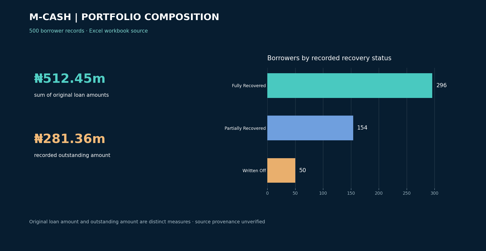

# M-Cash Loan Recovery Analysis
### Recovery status and outstanding exposure

An Excel portfolio case study examining 500 borrower records to support a structured review of loan recovery status and outstanding balances.

**Tools:** Excel · Pivot Tables · Dashboard Design  
**Analyst:** Chukwuemeka Ogo

**[View dashboards](docs/dashboard-gallery.md)** · [Read analytical notes](docs/analytical-notes.md)

## Business question

How can a collections team monitor recovery status and identify accounts requiring closer review?

## Dashboard preview

[Explore all dashboard views and version notes →](docs/dashboard-gallery.md)

## Key findings

| Metric | Result |
| --- | ---: |
| Distinct borrower IDs | 500 |
| Original loan amounts | ₦512,453,516 |
| Recorded outstanding exposure | ₦281,362,988.34 |
| Fully recovered loans | 296 |
| Partially recovered loans | 154 |
| Written-off loans | 50 |

Original loan amounts and outstanding exposure are different measures and should be reported separately.

## Decision use

1. Review large outstanding balances alongside recovery status before setting collection priorities.
2. Compare recovery rates within loan types as well as borrower counts.
3. Validate account-level balances and status definitions before operational use.

These recommendations identify next steps; they do not represent measured business impact.

## Approach

Review balances and recovery status at borrower level, then use pivot-based views to compare loan types and borrower characteristics. Segment rates should use the relevant segment population as their denominator.

## Explore the project

| Resource | Purpose |
| --- | --- |
| [Excel workbook](loan-recovery.update.xlsx) | Excel workbook |
| [Dashboard gallery](docs/dashboard-gallery.md) | Full-size views and version context |
| [Analytical notes](docs/analytical-notes.md) | Methodology, metric definitions, and limitations |

## Scope and limitations

The workbook’s external source is not identified. These are portfolio-exercise observations, with no documented recovery intervention or realised improvement. Demographic patterns do not establish borrower risk or causes of loss.

---

[Portfolio](https://mikkymo.github.io/portfolio/) · [LinkedIn](https://www.linkedin.com/in/ogochukwuemeka/)
